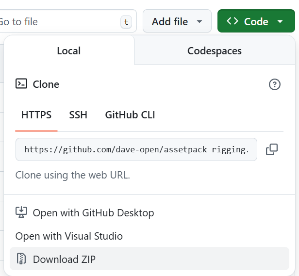
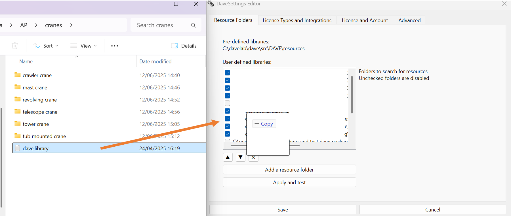
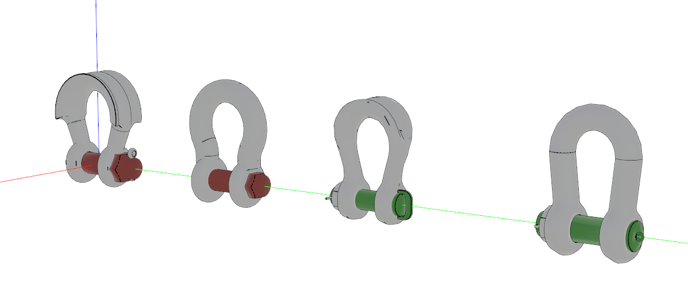
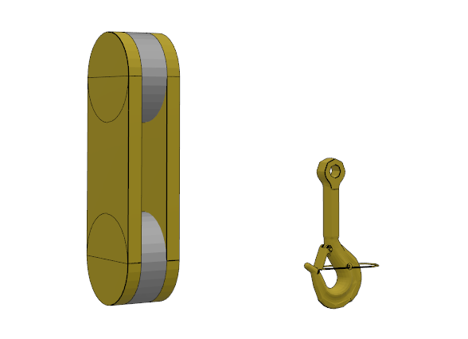
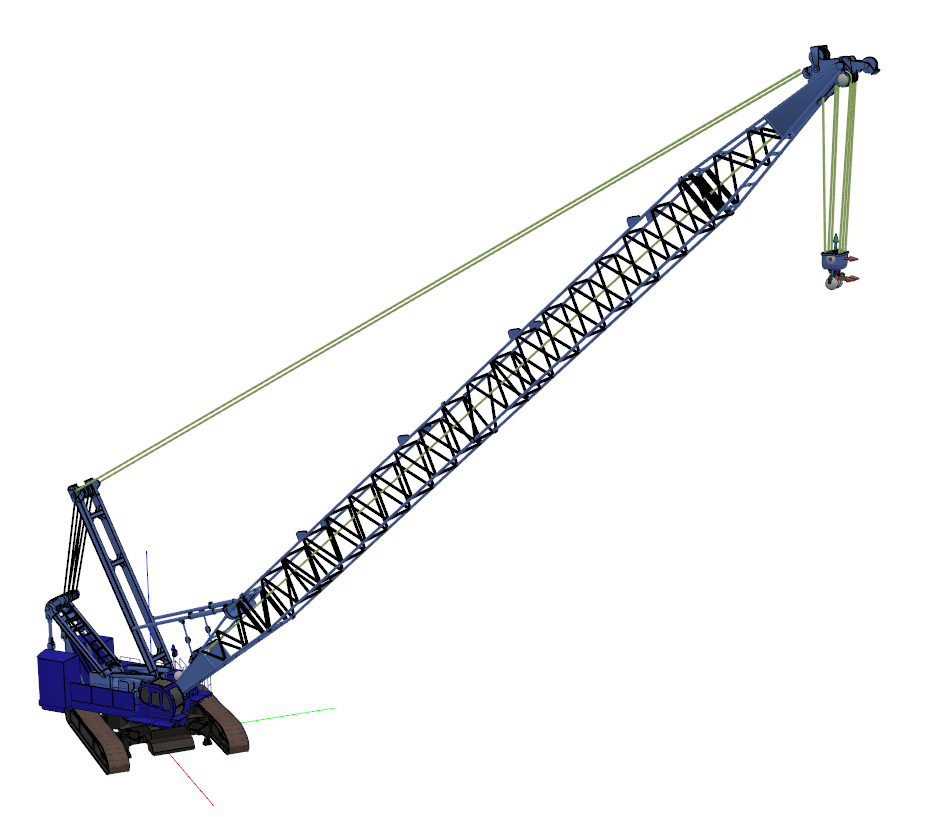
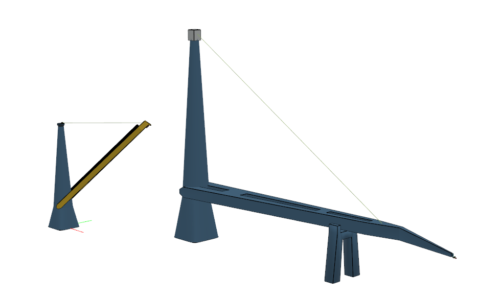
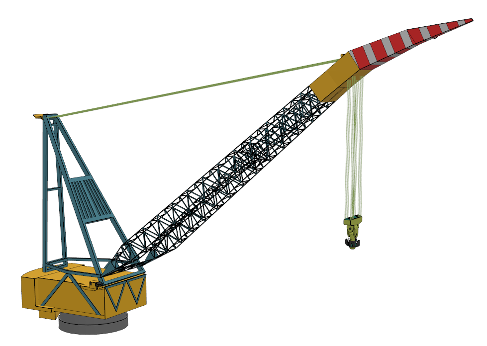
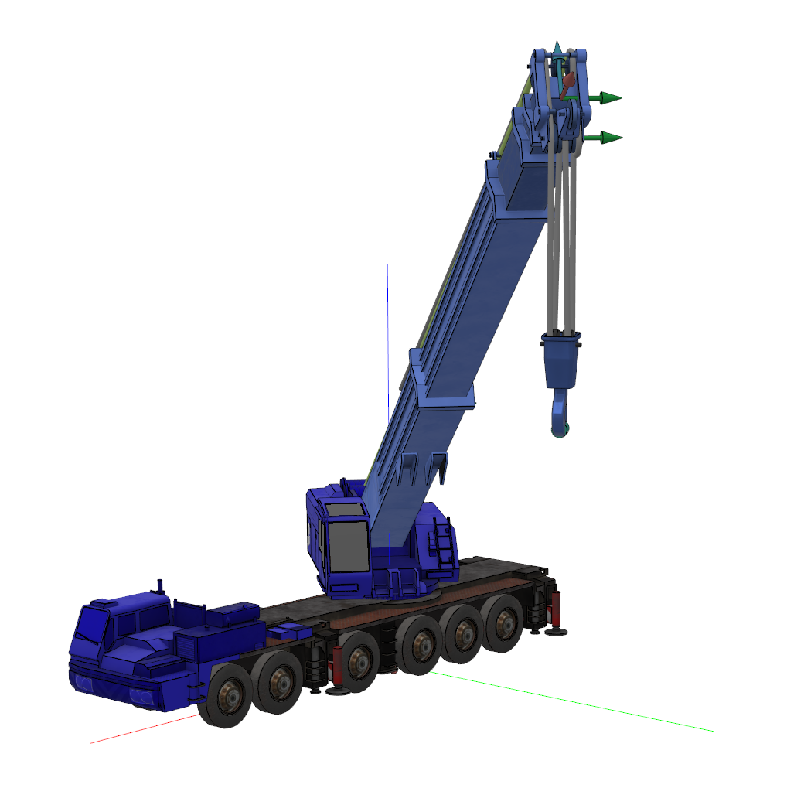
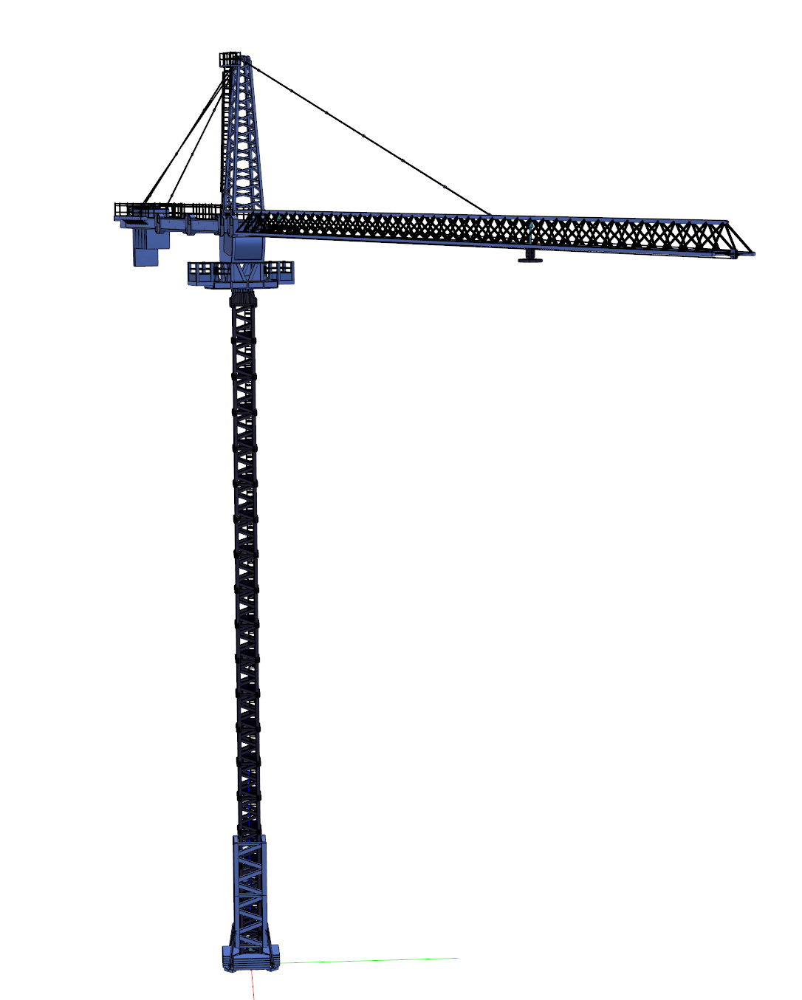
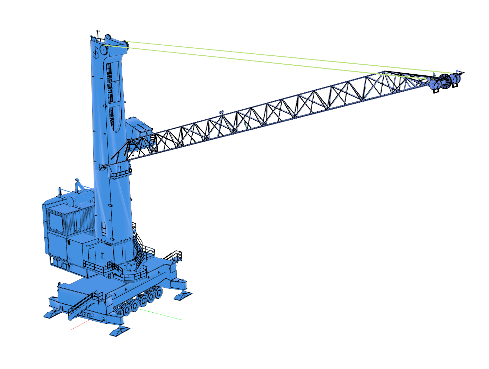

# Rigging pack

The assets in these packs are community made and can be used for free in dave. They are meant primarily as example or as starting point for your own models. You should not assume that anything in these assets is physically correct.

## Installation

### Step 1: Download

After downloading, extract the .zip file to a local or network folder.

(Git addicts may off course also clone the repository)

### Step 2: Register in dave

In dave, open file -> settings and then activate the "Resource Folders" tab.

Then drag and drop the dave.library file into the "user defined libraries" list.

Do this for each of the libraries that you want to use.

Click "Save" and you are ready to go!

## Shackles

Shackles contains the Green Pin and Crossby standard and wide body/sling shackles. Only four distinct visuals are used. These visuals are scaled to (approximately) match the selected shackle kind.

The library currently contains the P-6036, P6033, CA and CWB series.

## Connectors (Shackle alternatives)

Contains a number of shackle alternatives such as link-plates and rov shank hooks.

This is mainly to show how other types of connectors can be models as a shackle.

## Attributions

The following models were used when creating this package:

| model                                                        | by           | license        | info / link                        |
| ------------------------------------------------------------ | ------------ | -------------- | ---------------------------------- |
| Liebherr tower crane                                         | Cem Alagozlu | CC Attribution | https://sketchfab.com/cem.alagozlu |
| KA-2000 & SCX2800-2 CRANES (Telescope and crawler cranes) | drcrazzie    | CC Attribution | https://sketchfab.com/drcrazzie    |
| 158661951-659-jaw___hook_swivel_298216                       | CROSBY       | traceparts     | converted from step using occ      |
| 158662128-659-shank_hooks_1024803                            | CROSBY       | traceparts     | converted from step using occ      |
| Saipem 7000				 | R.P		| unknown | https://3dwarehouse.sketchup.com/model/cbed0ddc8103d0f1243aab46e65d48f/Saipem-7000-updated-5-5-09|
| Harbor crane / Tub mounted crane                             | MisterH      | CC Attribution | https://sketchfab.com/TGVMisterH   |
| ROV shank hook                                               | CROSBY       | traceparts     | converted from step using occ      |

CC Attribution: https://creativecommons.org/licenses/by/4.0/

traceparts: free to use and re-distribute: They are provided "For information only" and no liability is assumed by traceparts.com - https://info.traceparts.com/legal/general-gtu/

## Cranes

Contains a number of example cranes and hoists.

### Crawler crane and hoist

### Mast crane

Two sizes

### Revolving crane + r7000 hoist

### Telescope crane + hoist

### Tower crane

Set boom angle to 0

Use "extension" to move trolley over the boom

### Tub mounted crane

